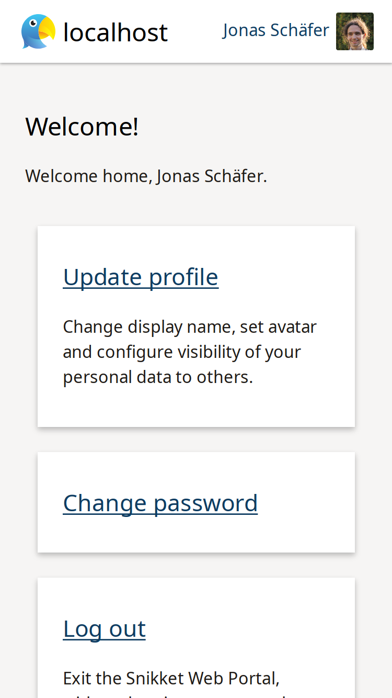

# Snikket Web Portal



## Development quickstart

```console
$ direnv allow
$ cp example.env .env
$ $EDITOR .env  # to adapt the configuration to your needs
$ pip install -r requirements.txt
$ pip install -r build-requirements.txt
$ make
$ quart run
```

## Configuring

### Purely via environment variables

For a list of required and understood environment variables as well as their
semantics, please refer to [`example.env`](example.env).

### Via python code

In addition to statically setting environment variables, it is possible to
initialise the environment variables in a python file. To do that, pass the
path to the python file as `SNIKKET_WEB_PYENV` environment variable.

The python file is evaluated before further environment variable processing
takes place. Every name defined in that file which begins with an upper case
ASCII letter is included in the processing of environment variables for
configuration purposes.

For a (non-productive) example of such a file, see `example.env.py`.
